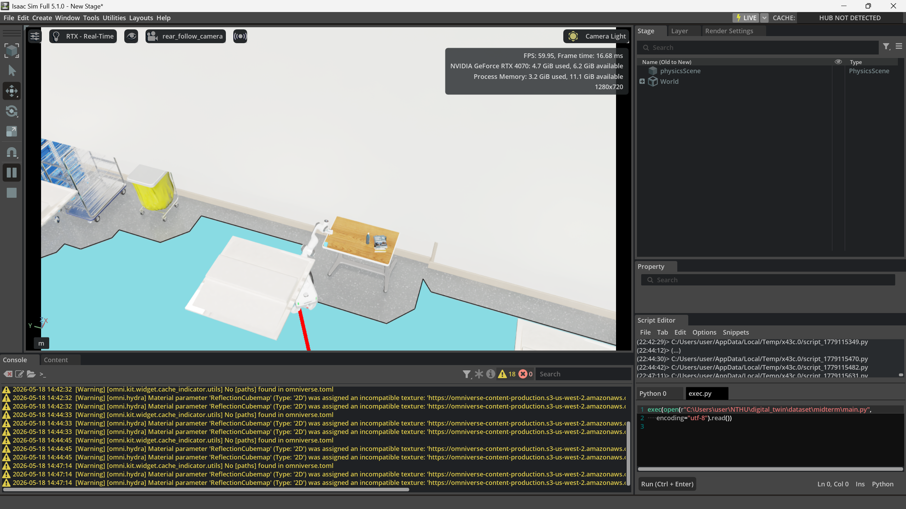

# IsaacSim Project Report

## Setup and notes

To run the project in Isaac Sim:

1. Run `python generate_exec.py` in the terminal to create `exec.py` first
2. Open the Script Editor in Isaac Sim.
3. Load `exec.py` in the Script Editor.
4. Click the Run button to start the simulation task.
5. After one simulation round finishes, click the Run button again to reset and start another round. 
6. I didn't enable Physics Collider visualization in the video, since my computer would lag a lot if I enable it.

## Setup Screenshot


## Troubleshooting
1. Somtimes the robot may get stuck after it fetch the cube, please give it few seconds. It would escape from the stuck state and continue to place the cube.
2. If the initial position of robot is under the stairs, the case will be failed due to unknown reasons. Please click the Run button again to reset and start another round.

## System Architecture

The system is built around one main Isaac Sim script, `main.py`, with `exec.py` used only as a small launcher for the Script Editor. The script loads the USD scene, creates the task cube, initializes the robot, and registers a physics callback that drives the whole task.

The robot is controlled through three main parts:

- The Nova Carter base uses navmesh path planning and wheel velocity control to move between the pick and place areas.
- The Franka arm uses inverse kinematics and joint-space trajectories to reach, grasp, lift, carry, and place the cube.
- The gripper is controlled separately by opening or closing the finger joints during grasp and release.

The FSM connects these parts together. Navigation states control the base, manipulation states control the arm and gripper, and custom facing states rotate the robot so the arm starts each pick or place action from a better direction.

## FSM Structure

The FSM is defined by the `PickPlaceState` enum in `main.py`. The full task sequence is:

```text
NAVIGATE_TO_PICK
-> FACE_CUBE
-> SETTLE
-> GRASP_SEQUENCE
-> ADJUST_ARM_X
-> NAVIGATE_TO_PLACE
-> FACE_PLACE
-> PLACE_RELEASE
-> DONE
```

The main state transition logic runs inside `_on_physics_step()`, which is called every physics step. Each state performs one small part of the task and only transitions to the next state after its local condition is complete. This keeps navigation, arm motion, and gripper behavior separated.

The basic states are:

- `NAVIGATE_TO_PICK`: follow a navmesh path to a walkable goal near the cube.
- `SETTLE`: stop the base and wait for a short time before moving the arm.
- `GRASP_SEQUENCE`: move the arm above the cube, descend, close the gripper, and lift.
- `NAVIGATE_TO_PLACE`: carry the cube to the selected place location.
- `PLACE_RELEASE`: lower the cube, open the gripper, and finish.
- `DONE`: stop the task.

The three custom states solve problems that are not handled well by the basic slide flow: correct robot orientation before grasping, safe arm pose after grasping, and correct orientation before placing.

## Custom State 1: `FACE_CUBE`

### Purpose

`FACE_CUBE` is inserted after `NAVIGATE_TO_PICK` and before `SETTLE`.

Navigation only moves the robot to a reachable position near the cube. However, reaching the position is not enough for grasping. The Franka arm is mounted on the robot, so the cube must also be located on a useful side of the robot. If the base stops with a bad yaw angle, the arm may not be able to reach the cube or the inverse kinematics solver may produce poor results.

`FACE_CUBE` fixes this by rotating the mobile base in place until one side of the robot faces the cube.

### Implementation

When the robot reaches the pick goal, the FSM does:

```text
NAVIGATE_TO_PICK -> FACE_CUBE
```

In `FACE_CUBE`, the code calls:

```python
self._face_target_step(self._get_current_cube_position())
```

This function reads the current cube position and computes the yaw angle from the robot to the cube:

```python
target_yaw = atan2(cube_y - robot_y, cube_x - robot_x)
```

Instead of forcing the robot's front side to face the cube, the code uses `ROBOT_SIDE_YAW_OFFSETS`:

```python
ROBOT_SIDE_YAW_OFFSETS = {
    "+Y": pi / 2,
    "-Y": -pi / 2,
}
```

This means the FSM checks which side of the robot, `+Y` or `-Y`, can face the cube with the smallest rotation. The helper `_choose_nearest_robot_side_error()` compares both possible side-facing yaw errors and picks the smaller one.

If the yaw error is larger than `FACE_CUBE_YAW_TOLERANCE = 0.02`, the robot rotates in place using differential wheel control:

```python
yaw_velocity = clip(error, -0.5, 0.5)
```

When the yaw error is small enough, `_face_target_step()` returns `True`, the wheels stop, and the FSM enters `SETTLE`.

### Why This State Is Needed

This state makes the grasp more reliable because it aligns the robot before arm motion starts. It reduces failures where the base reaches the cube but the arm approaches from an awkward direction. It also makes the behavior more deterministic because the grasp sequence starts from a controlled orientation.

## Custom State 2: `ADJUST_ARM_X`

### Purpose

`ADJUST_ARM_X` is inserted after `GRASP_SEQUENCE` and before `NAVIGATE_TO_PLACE`.

After grasping and lifting the cube, the arm may still be near the cube-grasp pose. This pose can be extended, low, or sideways relative to the robot body. If the robot starts navigation immediately, the arm and cube may collide with the environment, the carried cube may become unstable, or the base movement may disturb the grasp.

`ADJUST_ARM_X` solves this by moving the arm to a known post-grasp carrying pose before the robot drives to the place location.

### Implementation

When `GRASP_SEQUENCE` finishes, the FSM sets:

```python
self._holding_object = True
self._prepare_post_lift_x_adjust_sequence()
self._state = PickPlaceState.ADJUST_ARM_X
```

The `_holding_object` flag keeps the gripper closed during later states. The adjustment sequence contains one `ArmSegment`:

```python
ArmSegment(
    None,
    self.gripper_closed,
    settle_steps=self.post_lift_adjust_settle_steps,
    target_joints=self.post_lift_straight_arm_joints,
)
```

The target joint configuration is:

```python
[0.0, -0.35, 0.0, -1.80, 0.0, 1.45, 0.75]
```

This is a direct joint-space target, not an end-effector XYZ target. Using joint space here is intentional because the goal is not to reach a specific world position. The goal is to put the arm into a stable carrying posture.

During `ADJUST_ARM_X`, the FSM keeps the gripper closed:

```python
self._close_gripper()
```

Then it runs `_run_arm_sequence()`. After the arm reaches the carrying pose and finishes the short settle time, the code resolves the place goal, queries a navmesh path, resets the waypoint index, and transitions to:

```text
ADJUST_ARM_X -> NAVIGATE_TO_PLACE
```

### Why This State Is Needed

This state creates a clean separation between manipulation and navigation. The robot only starts driving after the cube is lifted and the arm is arranged into a safer pose. This improves task stability because the carried cube is less likely to hit objects or be dropped while the base moves.

## Custom State 3: `FACE_PLACE`

### Purpose

`FACE_PLACE` is inserted after `NAVIGATE_TO_PLACE` and before `PLACE_RELEASE`.

Like the pick position, reaching the place navigation goal is not enough. The robot also needs to be oriented so the arm can lower the cube onto the target surface. If the base reaches the place goal with a poor yaw angle, the arm may place the cube inaccurately or fail to reach the target.

`FACE_PLACE` rotates the robot in place until a useful side of the robot faces the place position.

### Implementation

When navigation to the place goal finishes, the FSM does:

```text
NAVIGATE_TO_PLACE -> FACE_PLACE
```

In `FACE_PLACE`, the code keeps the gripper closed and calls:

```python
self._face_target_step(self._place_cube_pos)
```

This uses the same orientation logic as `FACE_CUBE`, but the target is the selected place position instead of the current cube position. The robot computes the yaw direction to the place target, chooses the closest valid side of the robot, and rotates until the yaw error is within tolerance.

After the robot is correctly aligned, the wheels stop and the place sequence is prepared:

```python
self._prepare_place_sequence()
self._state = PickPlaceState.PLACE_RELEASE
```

### Why This State Is Needed

`FACE_PLACE` makes placement more reliable for the same reason that `FACE_CUBE` makes grasping more reliable. It ensures that the arm starts the release motion from a pose where the target is reachable from the correct side of the robot. Without this state, navigation could stop at the correct XY location but leave the arm facing away from the place target.

## Coordinate setup
Don't need to set up the coordinate system manually. The cube will be placed on the table or desk automatically by the script. You can refer to the next section for details about how the cube position is selected.

## Cube Position Selection

The script supports both fixed positions and randomized task positions.

The fixed fallback positions are:

```python
cube_position = [9.98115, -1.39854, 0.83727]
place_cube_pos = [22.93955, -3.11071, 0.85179]
```

However, `RANDOMIZE_CUBE_POSITIONS = True`, so the script tries to choose the pick and place positions automatically from the scene.

### Candidate Object Selection

The script searches the USD scene for objects whose name or path contains keywords:

```python
CUBE_POSITION_NAME_KEYWORDS = ["SideTable", "Desk"]
```

These keywords are used because side tables and desks are reasonable surfaces for placing a small cube. The script traverses all active prims in the stage and ignores the cube itself. For each matching object, it computes the world bounding box.

### Surface Filtering

An object is only accepted as a possible cube surface if:

- Its X and Y extents are larger than the cube size.
- The cube center height after placing it on top is within `0.8` to `0.90` meters.
- A nearby walkable navmesh point exists.
- The walkable point is close enough to the object, within `0.6` meters.
- The walkable point is slightly outside the object, so the robot can approach from outside the table or desk.

The script samples four possible cube positions near the top-surface corners of each valid object. The corner positions are inset by:

```python
CUBE_SIZE * 0.5 + CUBE_PLACEMENT_SURFACE_MARGIN
```

This avoids placing the cube exactly on an edge while still keeping it near a reachable corner.

### Pick and Place Pair Selection

After collecting valid candidate positions, the script randomly chooses one as the pick position. It then filters possible place positions using two constraints:

1. The place position must be at least `5.0` meters away from the pick position in XY distance.
2. The navmesh path between the pick and place walkable goals must exist and have no more than `500` path points.

The distance constraint prevents the task from becoming too trivial. The navmesh path constraint prevents selecting a pair that is too difficult or impossible for the robot to navigate.

If a valid pair exists, the script updates:

```python
self._cube_position
self._place_cube_pos
self._pick_goal_pos
self._place_goal_pos
```

It also moves the cube to the selected pick position using:

```python
self._cube.set_world_pose(position=self._cube_position)
```

If not enough valid candidates are found, or if no valid pick-place pair satisfies the constraints, the script falls back to the manually defined positions.